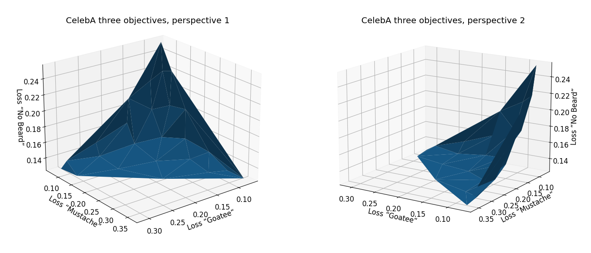
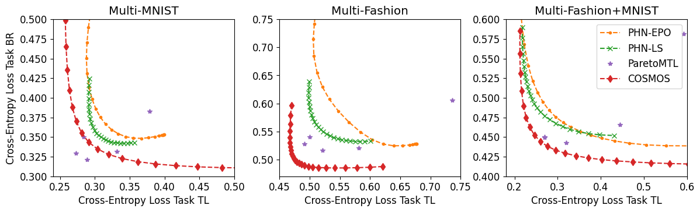

# COSMOS - Efficient Multi-Objective Optimization for Deep Learning

This is the official implementation for COSMOS: a method to learn Pareto fronts that scales to large datasets and deep models.

For details see paper.



## Usage

1. Download the dataset as described in `readme.md` in the respective data folder.
1. Run the code:

```bash
python multi_objective/main.py --dataset mm --method cosmos
```

For the logs and results see newly created folder `results`.

For the settings see [settings.py](multi_objective/settings.py)

---

Available datasets:

| command-line option  | Description                  |
|----------------------|------------------------------|
| `-d mm`              | Multi-MNIST dataset          |
| `-d mf`              | Multi-Fashion dataset        |
| `-d mfm`             | Multi-Fashion+MNIST dataset  |
| `-d adult`           | Adult dataset                |
| `-d compass`         | Compass dataset              |
| `-d default`         | Default dataset              |
| `-d celeba`          | CelebA dataset               |

---

Available algorithms:

| command-line option  | Description                         |
|----------------------|-------------------------------------|
| `-m cosmos`          | COSMOS algorithm                    | 
| `-m hyper_ln`        | PHN (Linear Scalarization) algorithm [1] | 
| `-m hyper_epo`       | PHN (EPO) algorithm [1]             | 
| `-m pmtl`            | ParetoMTL algorithm [2]             | 
| `-m single_task`     | Treat each objective as single task | 
| `-m uniform`         | Uniform scaling of all objectives   | 


[1] Navon, A., Shamsian, A., Chechik, G. and Fetaya, E., 2020. Learning the Pareto Front with Hypernetworks. arXiv preprint arXiv:2010.04104.

[2] Lin, X., Zhen, H.L., Li, Z., Zhang, Q. and Kwong, S., 2019. Pareto multi-task learning. arXiv preprint arXiv:1912.12854.




## Installation

Requirements:
1. CUDA capable GPU (I will port it for CPU usage in future)
1. Only tested on Ubuntu 20.04

Create a venv:

```bash
python3 -m venv cosmos
source cosmos/bin/activate
```

Clone repository:

```
git clone ...
cd moo
```

Install requirements:

```
pip install -r requirements.txt
```

The large number of dependencies is partly due to the baselines, available in this repository as well.

## Acknowledgments

To be done.

